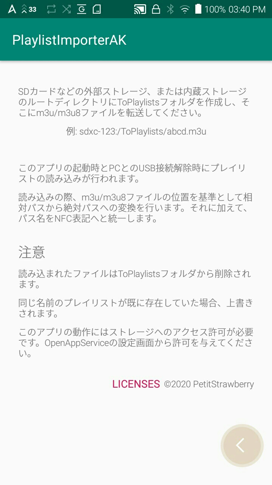

# PlaylistImporterAK
AK DAP(第4世代)向けのアプリです。

外部プレイリストを使用できるようにします。
- m3u/m3u8形式の外部プレイリストを読み込み、DAP内部のプレイリストデータベースに登録します。

(公式に再対応されそうなのでもはや必要なくなりそうです。そのようなわけで、ここに放流することで供養とします。)

その他の挙動の詳細は[アプリ内](#スクリーンショット)に書いてます。

# 注意
- Macとの接続前提として作ったのでWindowsのパス形式ではうまく動作しないかもしれません。
- SE100でしかテストしてません。
- すでに外部m3uファイルに対応した機種では使用できないかもしれないし、使用する必要もない。これはあくまでインポートするだけなので、公式の機能には遥かに劣ります。

# インストール
[リリース](https://github.com/PetitStrawberry/PlaylistImporterAK/releases)からダウンロードして、
APKEditorなどで[パッケージ名を書き換える](https://gist.github.com/PetitStrawberry/c7477b1c0f6d0faa845c9cff841440f1)なりしてOpenAppService画面からインストール

# 使い方
## 初回のみ
- 内部ストレージまたはSDカードなどの外部ストレージのルートディレクトリにToPlaylistsフォルダを作成
- 設定画面からストレージへのアクセスを許可

## 初回以降
1. USB接続(MTP)
2. ToPlaylistsフォルダにm3u/m3u8ファイルを転送
3. USB接続解除
4. おしまい

# スクリーンショット

